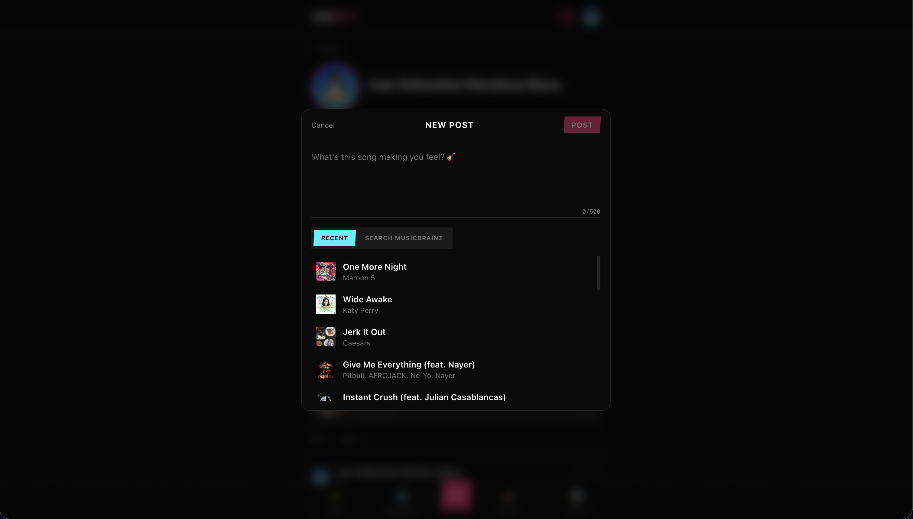
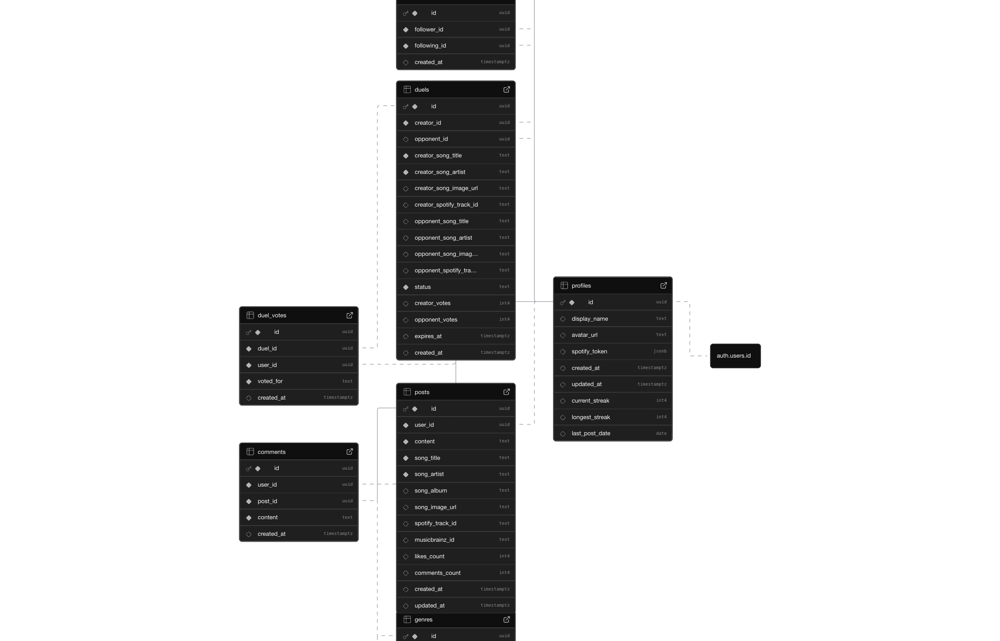

# Vibebify

A music-focused social media web app with a punk/rock aesthetic. Sign in with Spotify, explore your listening stats, share posts about songs, follow other users, view your Genre DNA, compete in song duels, and maintain daily posting streaks.

**Live:** [vibebify.ivanmendoza.dev](https://vibebify.ivanmendoza.dev/)

<p align="center">
  
</p>

---

## Table of Contents

- [Features](#features)
- [Tech Stack](#tech-stack)
- [Architecture](#architecture)
- [Database](#database)
- [Getting Started](#getting-started)
- [Environment Variables](#environment-variables)
- [Project Structure](#project-structure)
- [Screenshots](#screenshots)

---

## Features

### Spotify Integration
Sign in with your Spotify account. Vibebify pulls your recently played tracks, top artists, and top tracks across three time ranges (last 4 weeks, last 6 months, all time). Tokens refresh automatically on expiry.

### Social Feed
Two feed modes — **Feed** (posts from people you follow) and **Discover** (global). Create posts with optional song attachments picked from your Spotify history or searched via MusicBrainz. Like, comment, and delete your own posts.

### Genre DNA Card
A donut pie chart visualizing your top genres based on your favorite artists. Skip genres you don't identify with. Share as a 1080x1920 Canvas-generated image (Instagram story size) with your profile pic, top 3 artists, and Vibebify watermark.

### Song Duels
Challenge the community: pick a song, wait for an opponent to accept and pick theirs, then let everyone vote for 24 hours. Live vote bar visualization with a crown on the winning side.

### Streaks
Post daily to build your streak. Tracked automatically via a database trigger that checks consecutive days. Color tiers: default, orange (3+), cyan (7+), purple (30+).

### User Profiles & Search
Search users, view profiles with follower/following stats, see their posts, and follow/unfollow with haptic feedback.

---

## Tech Stack

| Layer | Technology |
|-------|-----------|
| **Framework** | [Next.js 16](https://nextjs.org/) (App Router, Turbopack) |
| **Language** | TypeScript |
| **Package Manager** | [Bun](https://bun.sh/) |
| **Database & Auth** | [Supabase](https://supabase.com/) (PostgreSQL, RLS, Auth) |
| **Auth Provider** | Spotify OAuth (via Supabase Auth) |
| **UI Components** | [React Aria Components](https://react-spectrum.adobe.com/react-aria/) |
| **Styling** | [Tailwind CSS v4](https://tailwindcss.com/) |
| **Validation** | [Zod v4](https://zod.dev/) |
| **Music Data** | Spotify Web API + MusicBrainz API |
| **Hosting** | Vercel |

---

## Architecture

Vibebify follows a **client-first architecture** with direct Supabase calls for all CRUD operations, keeping server-side API routes only for operations that require secrets (Spotify token refresh, external API proxying).

```
Browser (React)
    |
    ├── lib/db.ts ──────────► Supabase (direct client calls)
    │   (posts, likes,          ├── PostgreSQL + RLS
    │    comments, follows,     ├── DB Functions (plpgsql)
    │    duels, profiles)       └── Auth (Spotify OAuth)
    │
    └── Next.js API Routes ──► External APIs (server secrets)
        ├── /api/spotify/*       ├── Spotify Web API
        └── /api/search/music    └── MusicBrainz API
```

### Why this approach?

- **Supabase RLS** handles authorization at the database level — no middleware needed
- **DB functions** (`security definer`) handle atomic operations like accepting duels with row locking
- **Zod schemas** validate all inputs before they reach the database
- Only **3 API routes** remain (down from 16), all requiring server-side secrets

### Client Service Layer (`lib/db.ts`)

All database operations go through a centralized service layer:

```typescript
// 18 operations — posts, likes, comments, follows, profiles, duels
import { getFeed, createPost, likePost, followUser, getDuels, ... } from "@/lib/db";
```

### Validation (`lib/validations.ts`)

Zod v4 schemas for all user inputs:

```typescript
import { createPostSchema, createDuelSchema, ... } from "@/lib/validations";
```

---

## Database

Powered by Supabase PostgreSQL with Row Level Security (RLS) on every table.

### Schema Overview

```
profiles ─────────┐
  (id, display_name, avatar_url,    │
   current_streak, longest_streak)  │
                                    │
follows ◄─────────┤ follower_id → profiles.id
  (follower_id, following_id)       │ following_id → profiles.id
                                    │
posts ◄───────────┤ user_id → profiles.id
  (content, song_title,            │
   song_artist, song_image_url,    │
   spotify_track_id,               │
   likes_count, comments_count)    │
                                    │
likes ◄───────────┤ user_id + post_id (unique)
comments ◄────────┤ user_id + post_id
                                    │
duels ◄───────────┤ creator_id / opponent_id → profiles.id
  (creator/opponent song fields,   │
   status: open → active → finished,
   creator_votes, opponent_votes,  │
   expires_at: 24h)               │
                                    │
duel_votes ◄──────┘ user_id + duel_id (unique)
  (voted_for: 'creator' | 'opponent')
```

### Music Catalog (Normalized)

```
genres ──────────► artist_genres ◄──────── artists
  (name, slug)     (M2M)                    (name, spotify_artist_id, image_url)
                                              │
                                          song_artists (M2M, with position)
                                              │
                                            songs
                                              (title, spotify_track_id,
                                               musicbrainz_id, album_name,
                                               album_image_url)
```

### Database Triggers

| Trigger | Action |
|---------|--------|
| Post insert | Calculate streak (consecutive days → increment, else reset to 1) |
| Like insert/delete | Update `posts.likes_count` |
| Comment insert/delete | Update `posts.comments_count` |
| Duel vote insert | Update `duels.creator_votes` / `opponent_votes` |
| New user signup | Auto-create profile from `auth.users` |

### DB Functions

| Function | Purpose |
|----------|---------|
| `get_user_profile(target_id, current_user_id)` | Returns profile + follower/following counts + is_following in one call |
| `accept_duel(duel_id, user_id, song...)` | Atomic: row lock, validate, update status, upsert catalog |
| `upsert_genre(name)` | Slugify + deduplicate genres |
| `upsert_artist(name, spotify_id, image, genres[])` | Find-or-create artist, link genres |
| `upsert_song(title, artists[], ...)` | Find-or-create song, link artists |

### Row Level Security (RLS)

All tables have RLS enabled:

- **Profiles** — publicly readable, self-update only
- **Posts / Comments / Likes** — authenticated insert, self-delete only
- **Follows** — authenticated insert/delete own follows
- **Duels** — authenticated create, status-gated accept/vote

See the full ERD in the [Screenshots](#screenshots) section below.

---

## Getting Started

### Prerequisites

- [Bun](https://bun.sh/) (package manager & runtime)
- A [Supabase](https://supabase.com/) project
- A [Spotify Developer](https://developer.spotify.com/) app
- (Optional) [MusicBrainz](https://musicbrainz.org/doc/MusicBrainz_API) credentials

### Installation

```bash
# Clone the repo
git clone https://github.com/your-username/vibebify.git
cd vibebify

# Install dependencies
bun install

# Set up environment variables
cp .env.example .env.local
# Fill in your keys (see Environment Variables below)

# Run database migrations
bunx supabase db push

# Start development server
bun run dev
```

Open [http://localhost:3000](http://localhost:3000) in your browser.

### Commands

```bash
bun install          # Install dependencies
bun run dev          # Start dev server (Turbopack)
bun run build        # Production build
bun run lint         # Run ESLint
```

---

## Environment Variables

Create a `.env.local` file in the project root:

```env
# Supabase
NEXT_PUBLIC_SUPABASE_URL=https://your-project.supabase.co
NEXT_PUBLIC_SUPABASE_ANON_KEY=your-anon-key

# Spotify OAuth & API
SPOTIFY_CLIENT_ID=your-spotify-client-id
SPOTIFY_CLIENT_SECRET=your-spotify-client-secret

# MusicBrainz (optional, for song search fallback)
MUSICBRAINZ_CLIENT_ID=your-musicbrainz-client-id
MUSICBRAINZ_CLIENT_SECRET=your-musicbrainz-client-secret

# Site URL (for auth callbacks)
NEXT_PUBLIC_SITE_URL=http://localhost:3000
```

### Supabase Auth Setup

1. Go to your Supabase project → Authentication → Providers
2. Enable **Spotify** provider
3. Set the Spotify Client ID and Client Secret
4. Add `https://your-project.supabase.co/auth/v1/callback` as a redirect URI in your Spotify app

---

## Project Structure

```
app/
├── page.tsx                          # Entry: LandingPage or Dashboard based on auth
├── layout.tsx                        # Root layout, fonts, dark mode
├── globals.css                       # Tailwind v4, CSS variables, animations
├── auth/
│   ├── callback/route.ts             # OAuth callback handler
│   └── auth-code-error/page.tsx      # OAuth error page
└── api/                              # Only 3 routes (require server secrets)
    ├── spotify/recently-played/      # GET — recently played tracks
    ├── spotify/top/                  # GET — top artists/tracks
    └── search/music/                 # GET — MusicBrainz search

components/
├── dashboard.tsx         # Main app shell with tab navigation
├── landing-page.tsx      # Hero with glitch text + Spotify CTA
├── post-card.tsx         # Social post with song, likes, comments
├── compose-post.tsx      # Create post modal with song picker
├── comments-sheet.tsx    # Bottom sheet for post comments
├── duel-card.tsx         # Two-sided duel with vote bars
├── create-duel.tsx       # Create/accept duel modal
├── genre-dna-card.tsx    # Donut chart + IG story generator
├── user-profile.tsx      # Profile view with stats + posts
├── user-search.tsx       # Debounced user search
├── streak-badge.tsx      # Flame streak indicator
├── track-card.tsx        # Song list item
├── artist-card.tsx       # Artist card with genres
├── punk-button.tsx       # Styled button component
├── stat-badge.tsx        # Skewed stat display
├── section-header.tsx    # Section title with accent bar
├── time-range-tabs.tsx   # Short/medium/long term tabs
└── marquee-bar.tsx       # Scrolling text banner

lib/
├── db.ts                 # Client service layer (18 Supabase operations)
├── validations.ts        # Zod v4 input schemas
├── api.ts                # API route helpers (remaining 3 routes)
├── supabase/client.ts    # Browser Supabase client
├── supabase/server.ts    # Server Supabase client
├── supabase/middleware.ts # Session refresh
├── spotify.ts            # Spotify API helpers + token refresh
├── musicbrainz.ts        # MusicBrainz API client
└── haptics.ts            # Web Vibration API wrapper

supabase/migrations/      # 7 SQL migrations
├── 20260306000000_create_profiles_and_history.sql
├── 20260306010000_social_features.sql
├── 20260306020000_streaks_dna_duels.sql
├── 20260306030000_fix_duel_accept_rls.sql
├── 20260306040000_music_catalog.sql
├── 20260306050000_catalog_functions.sql
└── 20260306060000_query_functions.sql
```

---

## Design System

Dark theme with a punk/rock aesthetic.

### Color Palette

| Variable | Hex | Usage |
|----------|-----|-------|
| `--punk-pink` | `#ff2d7b` | Primary accent, follow buttons, vote bars |
| `--punk-cyan` | `#00f0ff` | Secondary accent, links, search focus |
| `--punk-yellow` | `#f5e642` | Warnings, streak highlights |
| `--punk-purple` | `#b44dff` | Avatars, DNA chart, streak tier |
| `--punk-orange` | `#ff6b2b` | CTAs, duel headers, action buttons |

### Design Patterns

- **Skewed elements** — `-skew-x-3` with inner `skew-x-3` for punk feel
- **Clash Display** — display font for headings (`font-display` class)
- **Uppercase tracking** — section headers with `tracking-wider`
- **Bottom sheets** — modals with drag handle on mobile
- **Web haptics** — vibration feedback on all interactive elements

---

## Screenshots

### Landing Page

<p align="center">
  
</p>

*Hero with glitch text animation, Spotify OAuth CTA, and scrolling marquee banner.*

### Feed & Dashboard

<p align="center">
  
</p>

*Social feed with posts, song attachments, likes, comments, and bottom navigation (Feed / Discover / Compose / Duels / Stats).*

### Stats

<p align="center">
  
</p>

*Top genre badge, artist/track counts, time range tabs (4 weeks / 6 months / all time), and ranked artist cards with circular images.*

### Genre DNA Card

<p align="center">
  
</p>

*Donut pie chart of your genre breakdown with profile pic in center, genre pills with skip buttons, top 3 artists with medal icons, and shareable IG story export.*

### Song Duels

<p align="center">
  
</p>

*Two-sided duel cards with VS divider, vote percentages, crown on the winning side, and cyan/pink vote bars.*

### User Profile

<p align="center">
  
</p>

*Profile view with follower/following/posts stats, follow button, and the user's post history.*

### Compose Post

<p align="center">
  
</p>

*Post creation modal with text input, Spotify recent tracks picker, and MusicBrainz search tab.*

### Database ERD

<p align="center">
  
</p>

*Entity relationship diagram showing profiles, posts, comments, follows, duels, duel_votes, and genres tables with foreign key relationships.*

---

## License

MIT

---

Built by [@ivannsmb](https://github.com/ivannsmb)
